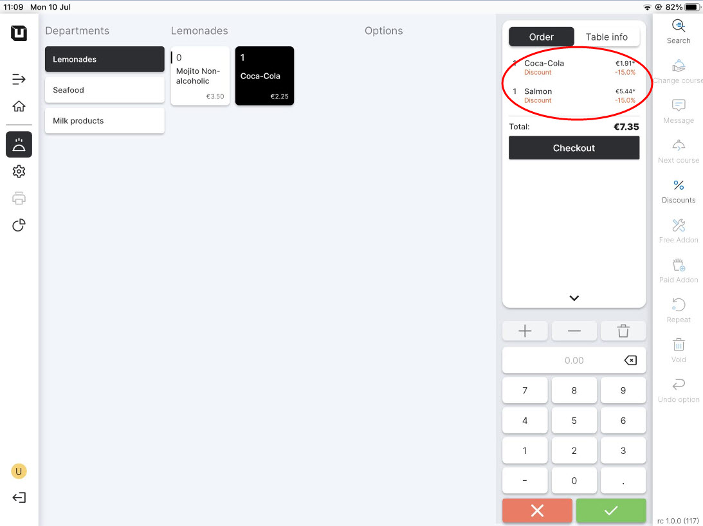

# Set up Discounts


This manual is intended for users who have already registered some product articles. If you need guidance on creating your first articles, please refer to the ['Quick Start'](../../../quick-start-food-and-drinks-mode.md) manual. Once you have set up your articles, you can start taking orders and apply discounts when finalizing the bill.


### Add a discount

To add discounts to your list, follow these instructions:

1. Navigate to **'Discounts' > 'General'.**
2. Click **'Add new discount'.**
3. Enter the required information about new discount:

* Name;
* Value type: it can be a percent or fixed sum of discount;
* Discount value: Enter the percentage rate of the discount if the **'Value type'** is set to percent, or enter the specific amount of the discount if it's a fixed discount;
* Discount type: choose **'Whole bill'** or **'Selected items'** for which the discount will be given;
* Excluded periods: indicate if your discount is unavailable in some periods of time;
* Applies to: Select the specific **'Department'**, **'Category'**, or other relevant criteria to which the discount will be applied;
* Reason: select or invent the reason for discount.

5. When you are finished, click on **'Save'** button.

<figure><figcaption>
Example of creating new discount
</figcaption></figure>

### Implement the discount on tablet in Table Plan mode

To provide your discounts to your customers, follow these instructions:

1. To access the **'Discounts'** feature, navigate to the **'Discounts'** section on your tablet connected to the Back Office system (instructions on how to connect a tablet can be found [here](../equipment/add-devices.md)). You can find this option from the order page.
2. Select the discount which is appropriate to your case.

<figure><figcaption>
Example of implementation the discount on tablet
</figcaption></figure>

3. You can see the result in the final bill.

<figure><figcaption></figcaption></figure>

Now that your discounts are ready to be used as part of the restaurant order, you can refer to the manual on [Discounts Reports](../../reports/discounts-reports.md) to enhance your tracking in this area.
