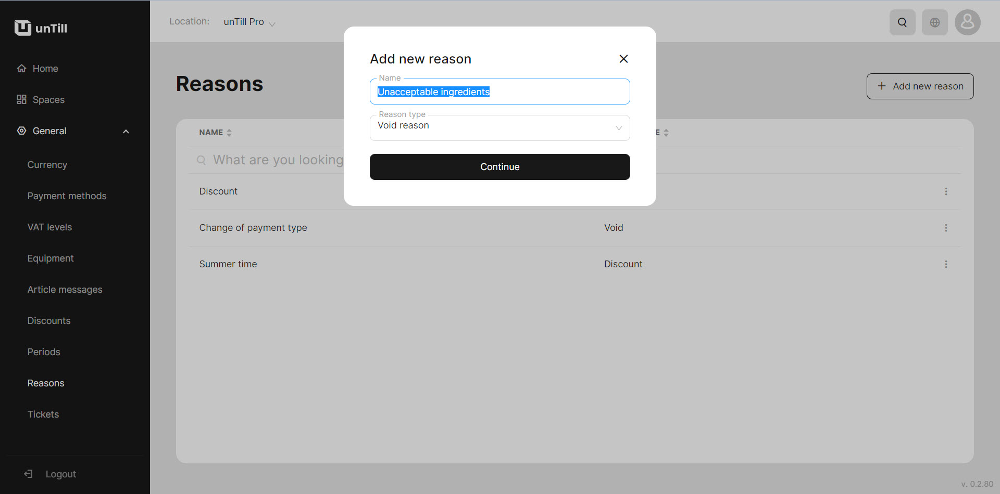

# Reasons

<table data-card-size="large" data-view="cards" data-full-width="true"><thead><tr><th></th><th></th><th></th></tr></thead><tbody><tr><td>Who can use this feature?</td><td>✔<mark style="color:green;">Owners</mark> in the Back Office</td><td>✔<mark style="color:orange;">POS users</mark></td></tr></tbody></table>

### What are 'Reasons'?

'Reasons' in unTill Air are brief reports that provide information about voids and discounts. POS users can utilize 'Reasons' to notify the manager about the reasons behind void or performed discounts.&#x20;

The process for using 'Reasons' is straightforward. It allows for either a custom message to be entered directly by the waiter in the POS or the creation of preconfigured reasons that are visible in the POS. These preconfigured reasons can be selected and applied when recording a discount or void transaction in the POS. They become available for use in the POS once the discount or void is acknowledged.

### Create a 'Reasons'

To create 'Reasons', please follow these steps:

1. Navigate to the **'General' > 'Reasons'**.
2. Click **'Add new reason'**.
3. Provide a name for this reason and select the reason type.

<figure><figcaption></figcaption></figure>

4. Click **'Continue'**.


Once you have created reasons for performing discounts and voids, you can now utilize them in the POS. To access a manual with detailed instructions on using these reasons, please [refer to the provided page](../../pos/reasons.md).

