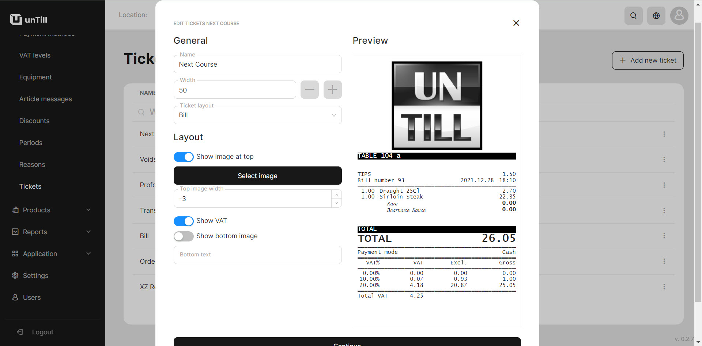

# Tickets

<table data-card-size="large" data-view="cards" data-full-width="true"><thead><tr><th></th><th></th><th></th></tr></thead><tbody><tr><td><strong>Who can use this feature?</strong> </td><td> <mark style="color:green;">Owners &#x26; Managers</mark> in the Back Office</td><td></td></tr></tbody></table>

### What's the 'Tickets'?

Various templates of receipts are available for you in the 'Tickets' section. You can use ready-made ticket options or create a new one based on the layout.

In this section you have tickets for different purposes:

* Bill
* Transfer
* Void
* Order
* Proforma
* XZ Reports

### How to set up ticket?

You have the capability to customize various characteristics of the tickets, including modifying their width, incorporating images, displaying or hiding VAT and entering text. This helps you to personalize the tickets according to your preferences and specific requirements.&#x20;

<figure><figcaption></figcaption></figure>

1. Navigate to the **'Tickets'**.
2. Click **'Add new tickets'**.
3. Give a name to new ticket and select the appropriate layout.
4. If desired, modify other settings according to your needs.
5. Click **'Continue'.**

