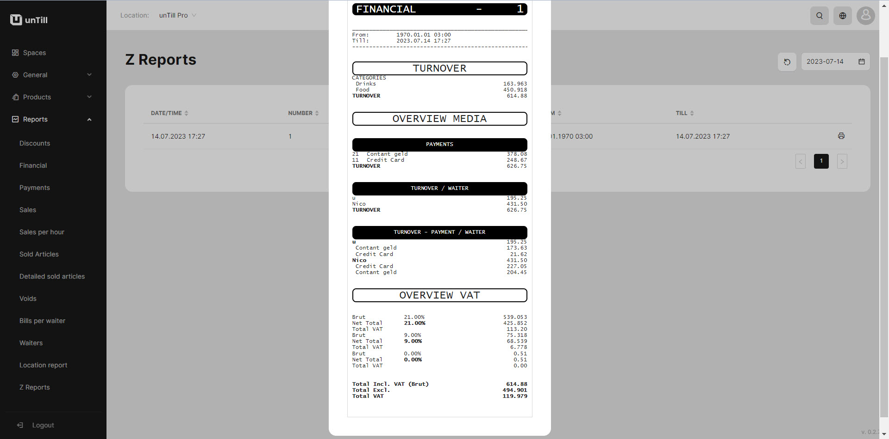
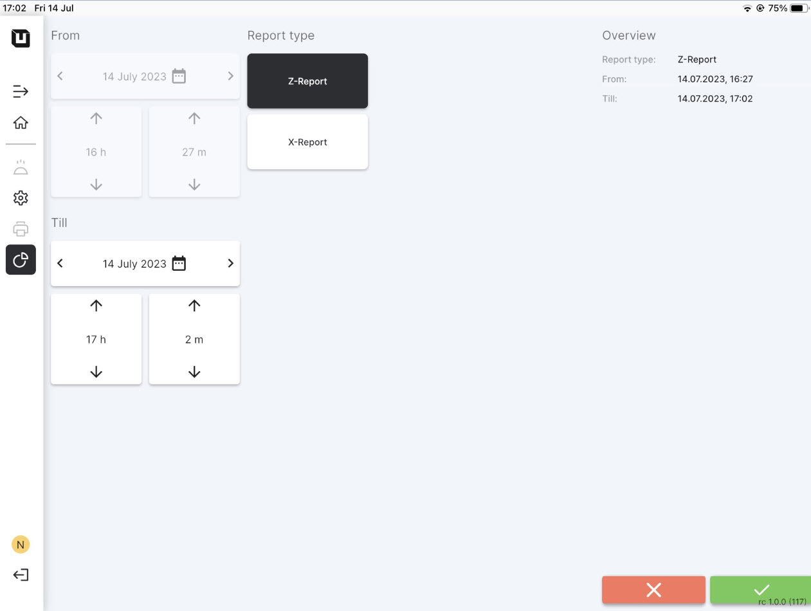

# Z Reports

<table data-card-size="large" data-view="cards" data-full-width="true"><thead><tr><th></th><th></th><th></th></tr></thead><tbody><tr><td><strong>Who can use this feature?</strong></td><td><ul><li><mark style="color:green;">Owners &#x26; Managers</mark> in the Back Office</li><li><mark style="color:orange;">POS users</mark> in the POS</li></ul></td><td></td></tr></tbody></table>

### What's the Z Report?

It's an overall total report for one day that is issued at the end of a business day. Waiters send this type of report to managers or owners for review. **Z Reports** serve as an opportunity for managers and owners to analyze the current turnover of the restaurant.

### What Z Report includes?&#x20;

* Overall turnover;
* Methods of payment and the final numbers of payments;
* Turnover for each waiter;
* Overview VAT.

<figure><figcaption>
Example of Z Report
</figcaption></figure>

### How to get Z Report?

To get a Z Report, please follow these instructions:

1. Open the **'unTill Runner'** application on your tablet (if you don't have the application or your device isn't connected, please [refer to this manual](../general/equipment/add-a-device.md)).
2. In the POS navigate to the **'Reports'** section.
3. Click **'Z Report'**.
4. Confirm this action.

<figure><figcaption></figcaption></figure>

5. Then in the Back Office navigate to the **'Reports' > 'Z Reports'**.
6. Now you can open and print this report.
