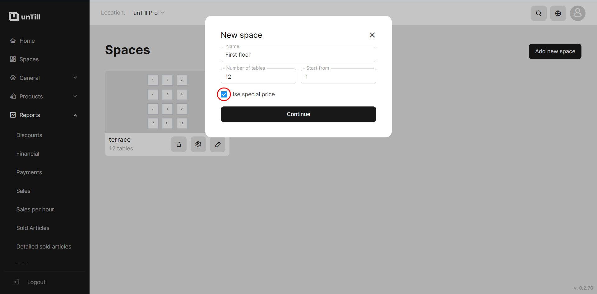
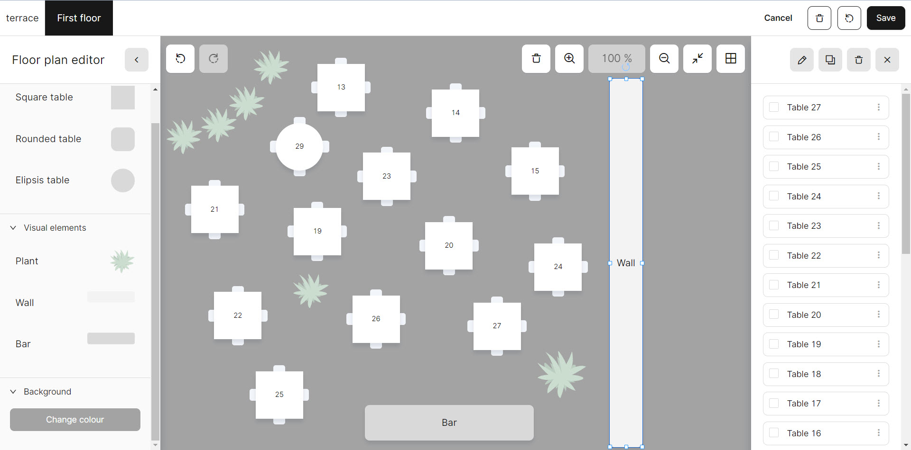

# Set up the Space

Here are a few steps to help you set up your **'Space'**:

1. Navigate to the **'Space'** on your left side bar.
2. Click **'Add new space'**
3. Give a name to your new space and specify the number of its tables.

* If you are using a **'Special price'** for your particular space, it needs to be mentioned

<figure><figcaption>
Example of creating new space with special price
</figcaption></figure>

4. Click on the space that just appeared.
5. Now you can modify some settings and conditions of space:

* You can add new tables;
* You can pick the shape, height, width and rotation angle of tables and other subjects;
* You can change the visual elements of space such as the background color and the presence of plants or walls.

<figure><figcaption></figcaption></figure>

6. Click the **'Save'** button after the configuration is completed.

_At the top left corner of the page you can switch between different spaces._
