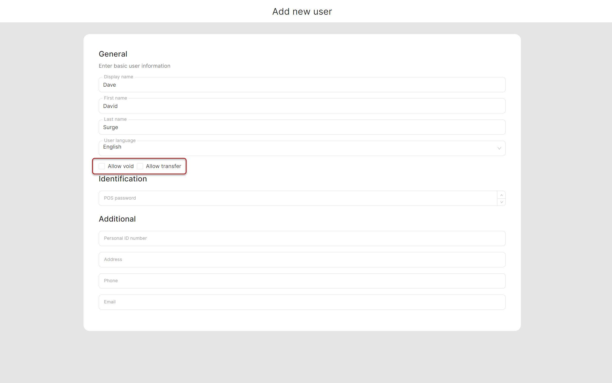

# Add new user (waiter)

<table data-card-size="large" data-view="cards" data-full-width="true"><thead><tr><th></th><th></th><th></th></tr></thead><tbody><tr><td><strong>Who can use this feature?</strong></td><td><ul><li><mark style="color:green;">Owners &#x26; Managers</mark> in the Back Office</li></ul></td><td></td></tr></tbody></table>

Since the launch you already have at least one user (waiter), but let's look at how to add or remove other users.

To add new user follow these steps:

1. Navigate to the **'Users'** on the left sidebar.
2. Click **'Add new user'.**
3. Provide the information about user.
4. Pay the attention to different options:

* **Allow void**
* **Allow transfer**

<figure><figcaption></figcaption></figure>

If you trust your stuff and can afford them making a voids and transfers, you are able to give the access for waiters to these features.

5. Click **'Save' button'**.


So, you've added new user to list. Now this user can handle POS on tablet.

