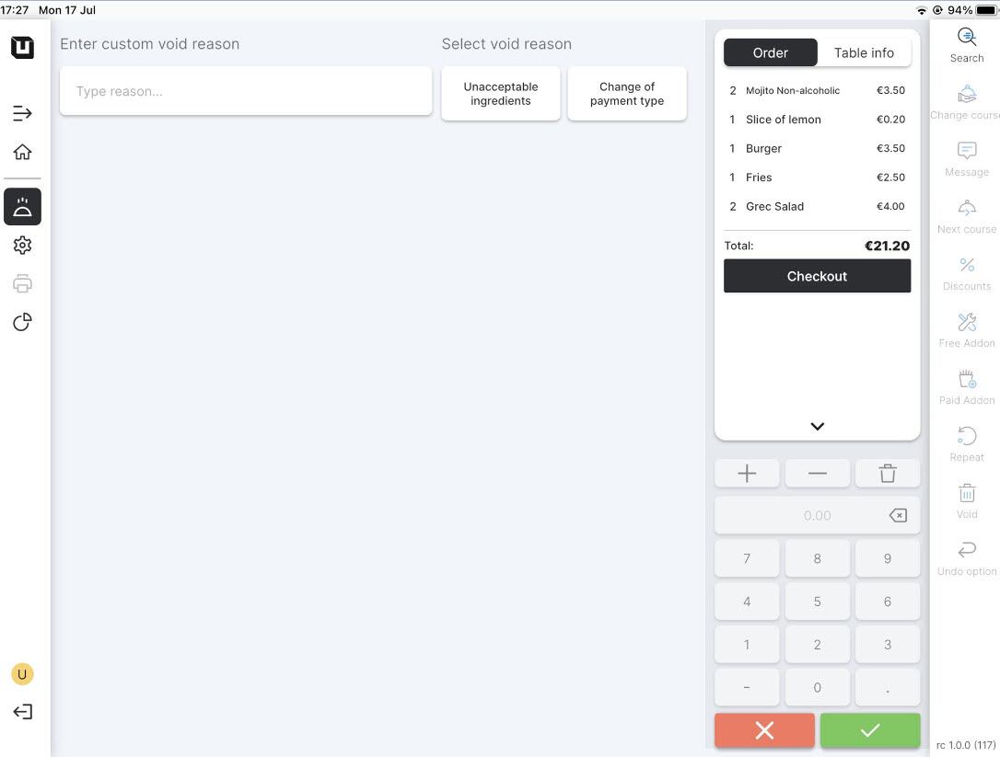
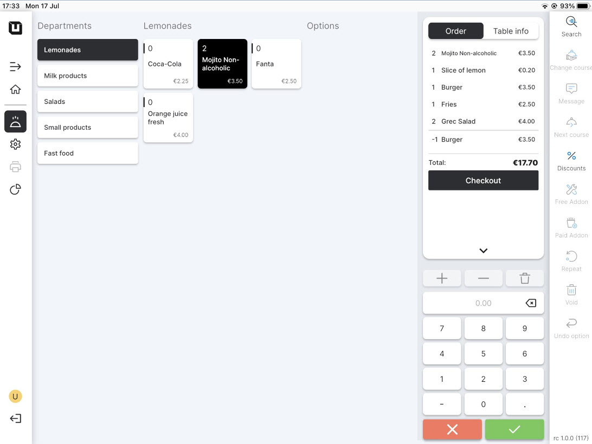

# Use Reasons

<table data-card-size="large" data-view="cards" data-full-width="true"><thead><tr><th></th><th></th><th></th></tr></thead><tbody><tr><td><strong>Who can use this feature?</strong></td><td>✔<mark style="color:orange;">POS users</mark></td><td></td></tr></tbody></table>


If you have not yet created 'Reasons', please [consult the provided manual](manage-reasons.md) for instructions on how to do so.


To start using 'Reasons' in the POS, please follow these steps:

1. Open the application **'unTill Runner'** on your tablet.
2. Create any order and click :white\_check\_mark:
3. Return to previous order by clicking on the table.



* Click on a specific item from the order and tap on the 'Void' button.
* Select the void reason using the reason that was recently created in the Back Office.
* Confirm the action by :white\_check\_mark:



* Click on a specific item from the order and tap on the 'Discount' button.
* Select the discount reason using the reason that was recently created in the Back Office.
* Confirm the action by :white\_check\_mark:



<figure><figcaption></figcaption></figure>

4. After performing the action and indicating the reason, you can verify that the price of the order has been updated accordingly.

<figure><figcaption></figcaption></figure>
