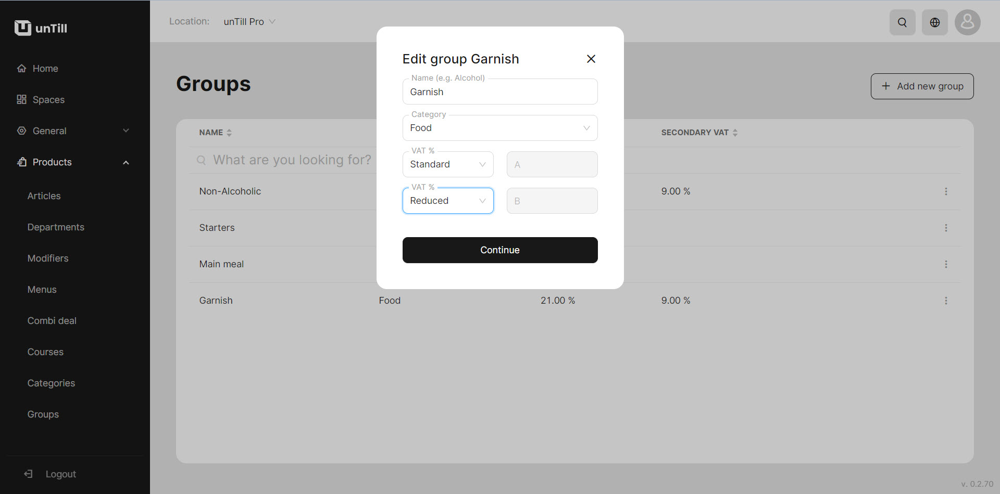

# Add secondary VAT (BO)

<table data-card-size="large" data-view="cards" data-full-width="true"><thead><tr><th></th><th></th><th></th></tr></thead><tbody><tr><td><strong>Who can use this feature?</strong></td><td><ul><li><mark style="color:green;">Owners</mark> in the Back Office</li></ul></td><td></td></tr></tbody></table>

Products can be sold in different sales areas, which means that the VAT for each area can vary. For example, a product sold in a restaurant may have a different VAT rate compared to the same product sold directly at a point of sale. To accommodate this, there is a need to add secondary VAT to individual items when necessary.

This manual will provide you with a step-by-step guide on how to add a second VAT to an item. By following these instructions, you will be able to accurately assign the appropriate VAT rate to each product based on its sales area.

To add secondary VAT, please follow these steps:

1. Navigate to the **'Products' > 'Groups'**&#x20;
2. Add a new group or edit an existing one
3. Add a secondary VAT below the first VAT field

<figure><figcaption></figcaption></figure>

4. Click 'Continue'


You have successfully created a group with a secondary VAT.


