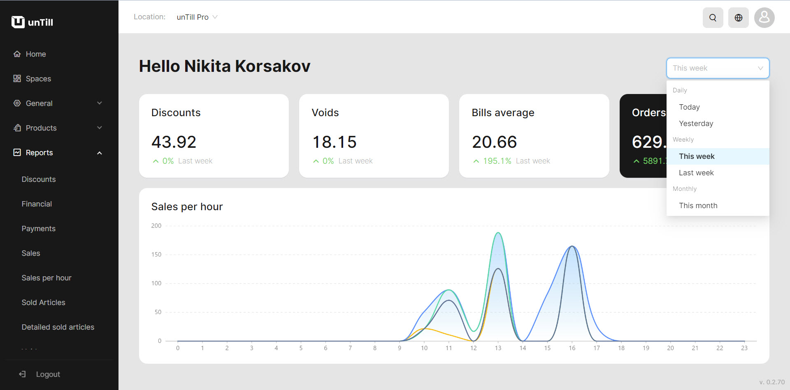

# Home page

<table data-card-size="large" data-view="cards" data-full-width="true"><thead><tr><th></th><th></th><th></th></tr></thead><tbody><tr><td><strong>Who can use this feature?</strong></td><td>✔<mark style="color:green;">Owners</mark> in the Back Office</td><td></td></tr></tbody></table>

Your starting point in the Back Office will be the 'Home page' where a dashboard is located. In this dashboard, you will find detailed statistics and various types of concise reports. This manual provides you with information about what you can precisely find on the 'Home page'.

<figure><figcaption></figcaption></figure>


On the top right side, you are able to switch between different periods, which gives you the opportunity to track reports for any specific period.


On this dashboard in a 'Home page' you can see:

* Reports on discounts (amount of discounts for the selected period)
* Reports on voids (amount of voids for the selected period)
* Reports on bills average (average amount of bill for the selected period)
* Reports on orders (amount of all orders for the selected period)

