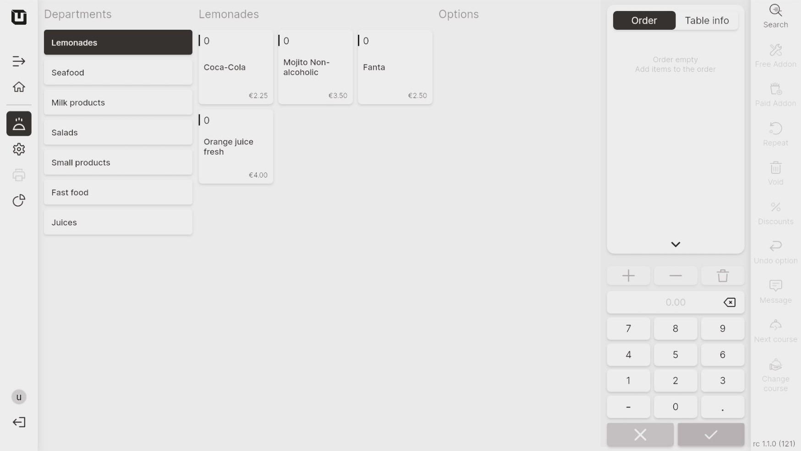

# Use Articles

After creating articles in your inventory, you can utilize them in the POS to process customer orders efficiently. These articles become accessible to your POS users, allowing them to select and add the desired items to the order, providing a seamless ordering process for your customers.

To use articles, please follow these steps:

1. Open the application on your tablet.
2. Click on any table in your designated space to initiate and process a new order.
3. Now, you can directly see the articles you have created in the POS. These articles are readily available for selection when you are processing customer orders.

<figure><figcaption></figcaption></figure>


Now, you can easily make orders by selecting the desired articles from the list.

