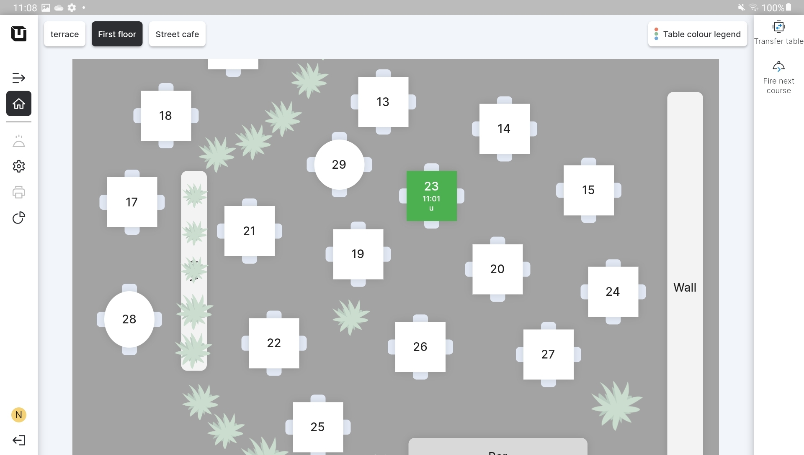

# Table Plan mode

### What's the Plan mode?

This mode is specifically designed for restaurant businesses with various dining spaces, such as a terrace, first floor, or any other distinct areas. It allows you to efficiently manage and organize orders in different spaces within your restaurant.

In the **'Table Plan'** mode, you can create a visual representation of the tables in a designated **'Space'** within your restaurant. This mode is designed to facilitate the seamless accommodation of customers by waiters in different dining areas.

<figure><figcaption></figcaption></figure>

### POS user and Table Plan

In the 'Table Plan' mode, the POS user is provided with an intuitive visual interface that displays the entire space, complete with tables and their corresponding statuses. This mode offers a comprehensive overview of the restaurant's layout, allowing the user to efficiently manage and track the status of each table.

Unlike the **'Direct Sales mode'**, where transactions are typically processed directly without a visual representation of the tables, the **'Table Plan'** mode allows for a more organized and structured approach to table management. POS users can easily view which tables are occupied, which are available and even identify tables that require attention, such as those awaiting cleaning or preparation for new guests.

### Standard functions in the POS Table Plan mode

Feature 'Search' in the POS allows the waiter to find the particular item quicker in any 'Department.' This feature is equal for both 'Table Plan' and 'Direct Sales' modes.

The 'Undo' option in the POS provides you with the ability to easily return to the previous step, helping you correct any mistakes or oversights that might occur during the order process. If you accidentally add an item, select the wrong option, or make any other changes, the 'Undo' function comes to your aid.
