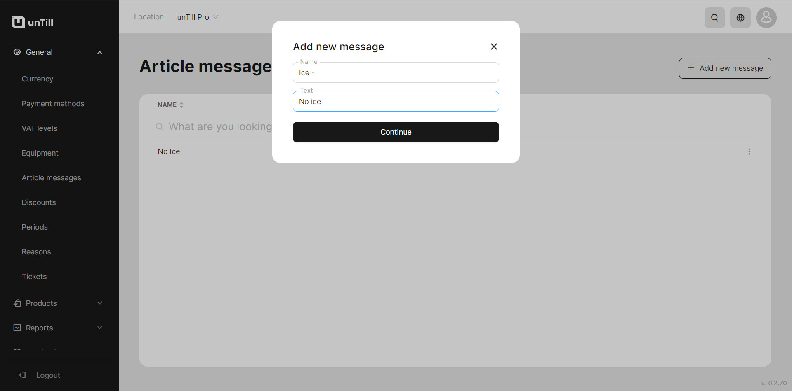
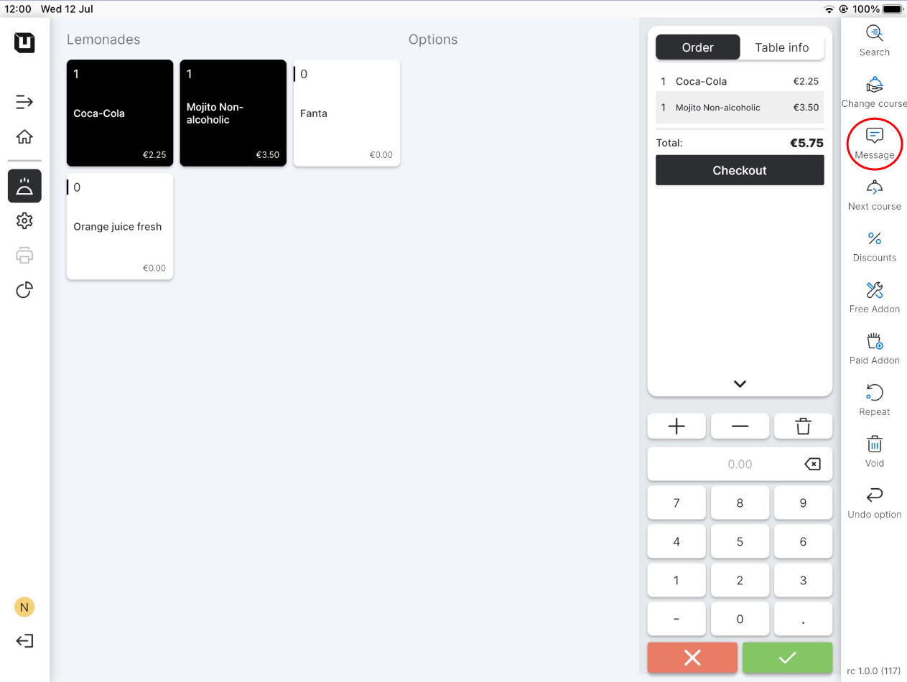
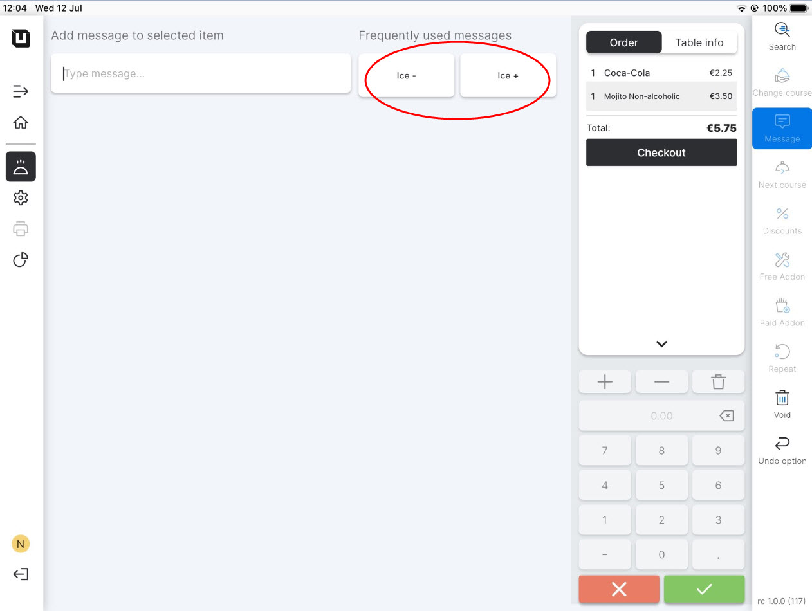

# Manage Article messages

<table data-card-size="large" data-view="cards" data-full-width="true"><thead><tr><th></th><th></th><th></th></tr></thead><tbody><tr><td><strong>Who can use this feature?</strong></td><td><ul><li><mark style="color:green;">Owners</mark> in the Back Office</li><li><mark style="color:orange;">POS users</mark></li></ul></td><td></td></tr></tbody></table>

Please, follow these steps to create the 'Article messages':

1. Navigate to the **'General' > 'Article messages'.**
2. Click **'Add new message'.**
3. Give a name and type the text of your message.

<figure><figcaption></figcaption></figure>

4. You can create several '**Article messages'** (e.g. 'Ice - '\[no ice] ; 'Ice +'\[more ice])
5. Click **'Continue'.**


Now you are able to use 'Article messages' in the POS. To learn about how it implements in the POS, please [refer to the provided manual](use-article-messages-pos.md).


4. Switch to application for the POS on the tablet.
5. Create any order and click **'Message'.**

<figure><figcaption></figcaption></figure>


User can type a message manually, but now after the saving 'Article messages' you may see them in the 'Frequently used messages' section. &#x20;


<figure><figcaption></figcaption></figure>

6. Select one of these messages for the item, and the special description of the product from the message will appear under the item name.
