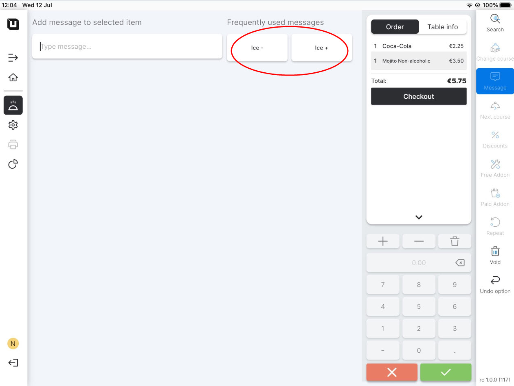

# Use Article messages

To use an Article message in the POS, please follow these steps:

1. Switch to application for the POS on the tablet.
2. Create any order and click **'Message'.**

<figure><figcaption></figcaption></figure>


User can type a message manually, but now after the saving 'Article messages' you may see them in the 'Frequently used messages' section.


<figure><figcaption></figcaption></figure>

3. Select one of these messages for the item, and the special description of the product from the message will appear under the item name.
