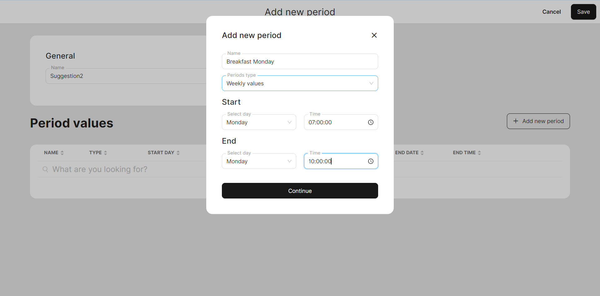

# Discounts with period

When setting up discounts, you have the opportunity to flexibly adjust the validity period of the discount. You can specify the start date and the end date by specifying the exact period during which the discount will be valid. This will help you create time-limited promotions that meet your needs. As soon as the specified expiration date is reached, the discount will automatically expire.

### Set up the 'Period'

Please follow these steps to set up a specific period:

1. Navigate to the **'General' > 'Periods'**&#x20;
2. Click **'Add new period'**
3. Give a name to 'General' and click **'Add new period'** again on this page
4. Give a name to your new period
5. Select **'Periods type'**

| Periods type        | Description                                                                                                             |
| ------------------- | ----------------------------------------------------------------------------------------------------------------------- |
| Weekly values       | You can determine the day of the week and hours when your discount will be available. This offer will repeat each week. |
| One-time use values | You can establish a single period for your discount.                                                                    |
| Annual values       | You can establish a single period for your discount and this will be repeated in one year.                              |
| Daily values        | Your discount will be available everyday. You can determine the hours when the offer is active.                         |

6. According to your selected **'Periods type'**, you may provide information about the time limits of your discount.

<figure><figcaption>
Example of creating the 'Weekly time' period for discount
</figcaption></figure>

7. Click **'Continue'**
8. Click **'Save'**


You've added your new period succesfully.


### Implement 'Period' for discount

Please follow these steps to implement 'Period' for discount:

1. Navigate to the 'General' > 'Discounts'
2. Click 'Add new discount'
3. Enter the requested information and pay the attention to 'Excluded period'
