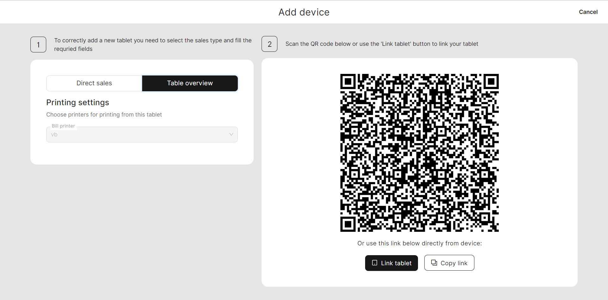
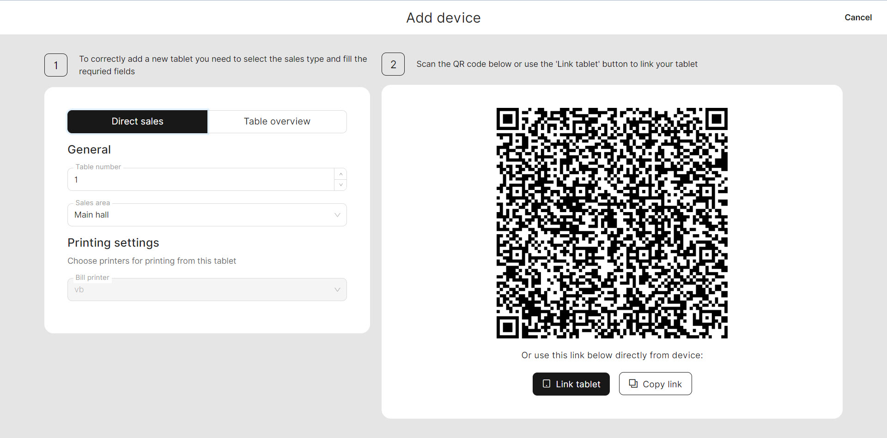

# How to add devices?

In order to effectively manage the restaurant and process orders, it is crucial to establish essential devices such as printers, terminals, and tablets.&#x20;

To learn how to establish these devices, please refer to the manual specifically dedicated to device connectivity. This manual will provide you with clear instructions and guidance on adding your devices for operation within the unTill Air system.

A few steps to add devices:

1. [Sign in](../../getting-started/quick-start/sign-in-to-untill-air.md) to your account.
2. Navigate to **'Equipment'** under the **'General'** section.
3. Click **'Add new equipment'**.
4. Select what kind of devices you want to establish.


Note: If you have not yet added a printer and terminal to your device list, you will not be able to add a tablet. Therefore, it is necessary to first add a printer and terminal to your device list before proceeding to add a tablet.


### Add new printer

1. Give a name for your new printer.
2. Select the aim of using it.
3. Enter the technical information about your printer or choose 'Null printer'.


If you don't have a printer yet, select 'Null printer' feature to simulate the working process without printing actual receipts.


4. Click **'Save'**.

### Add new terminal

1. Give a name for your new terminal.
2. Enter the POIID for your terminal.
3. Click **'Continue'**

### Add new tablet


For adding a tablet to Back Office you need to install at first the application 'unTill Runner' on your device.


1. At first, you have the choice to select the type of tablet functionality that suits your needs. You can opt for either the ['Direct sales'](../direct-sales-mode.md) mode or the ['Table Overview'](../table-overview-mode.md) mode:











**If you have 'Direct sales' mode:**

* Specify the number of tables;
* Select the space which you'll use;
* Select the printer;
* Scan QR Code by your tablet.

**If you have 'Table Overview':**

* Select the printer;
* Scan QR Code by your tablet.

<figure><figcaption></figcaption></figure>

 

<figure><figcaption></figcaption></figure>

