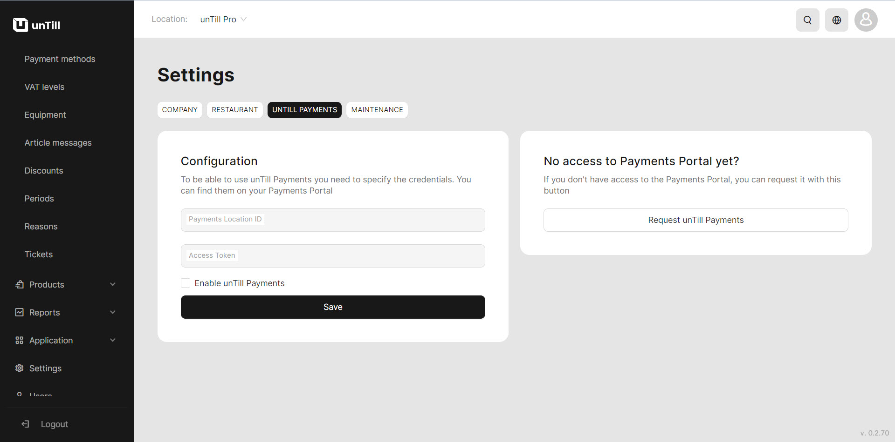

# Payment methods (Card)

Payment by cash doesn't require any additional actions from the user. Cash payment is available from the first steps in unTill Air. However, cashless payment requires some additional steps, as it requires access to unTill Payments.

### How to get an access to unTill Payments?

To join unTill Payments, please reach out to your reseller if you work with unTill Air through them. If you work directly with us, follow these steps to gain access to unTill Payments without a reseller:

1. Navigate to the **'Settings' > 'unTill Payments'.**
2. If you do not yet have access to the Payments Portal, please submit a request.

<figure><figcaption></figcaption></figure>

3. Navigate to the **'General' > 'Payment methods' .**
4. Click **'Add new payments method'**.
5. Give a name and number of the payment.
6. Select 'cash' payment kind.&#x20;
7. Click **'Continue'**.

### Use the card in the POS

1. To begin, install and open the 'unTill Runner' application on your tablet (for instructions on how to connect your tablet, please refer to the [provided documentation](equipment/add-devices.md)).
2. Create any order on the tablet.
3. Verify the capability of using a card to submit a payment in the POS on the tablet.

