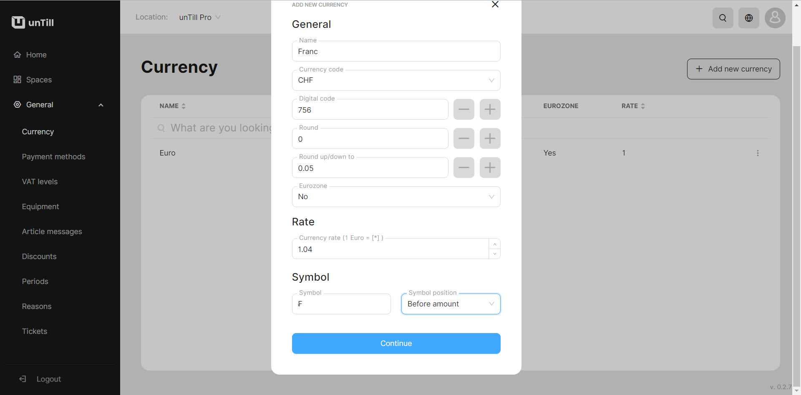

# Currency

<table data-card-size="large" data-view="cards" data-full-width="false"><thead><tr><th></th><th></th><th></th></tr></thead><tbody><tr><td><strong>Who can use this feature?</strong></td><td>✔<mark style="color:green;">Owners</mark> in the Back Office</td><td></td></tr></tbody></table>

In unTill Air you feel free to add a currencies in Back Office and then implement them while accepting payments in POS. The default currency in unTill Air is Euro(€), but you are able to customize that and use other currencies which are needed in your business.&#x20;

### Add a currency

Please, follow these instructions to add new currencies to your list:

1. Navigate to the **'General' > 'Currency'**.
2. Click **'Add new currency'**.
3. Provide the information about the currency:

* Enter the name of the currency;
* Select the currency code;
* Select the values to which you want to round the amount;
* Enter the exchange rate against the Euro(€);
* Select where the symbol of currency will be placed;

<figure><figcaption></figcaption></figure>

4. Click **'Continue'.**

&#x20;

