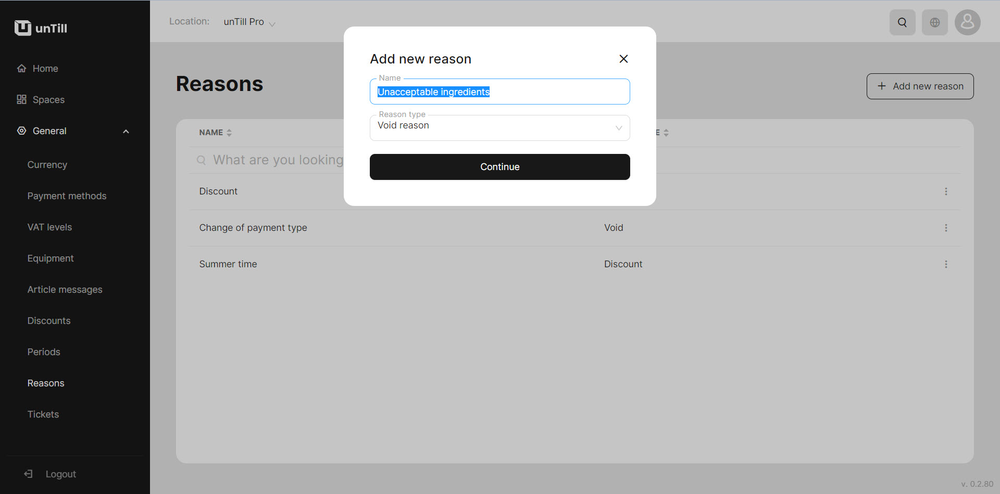

# Manage Reasons

<table data-card-size="large" data-view="cards" data-full-width="true"><thead><tr><th></th><th></th><th></th></tr></thead><tbody><tr><td><strong>Who can use this feature?</strong></td><td>✔<mark style="color:green;">Owners</mark> in the Back Office</td><td>✔<mark style="color:orange;">POS users</mark></td></tr></tbody></table>

To create **'Reasons'**, please follow these steps:

1. Navigate to the **'General' > 'Reasons'**.
2. Click **'Add new reason'**.
3. Provide a name for this reason and select the reason type.

<figure><figcaption></figcaption></figure>

4. Click **'Continue'**.


Once you have created reasons for performing discounts and voids, you can now utilize them in the POS. To access a manual with detailed instructions on using these reasons, please [refer to the provided page](use-reasons-pos.md).

