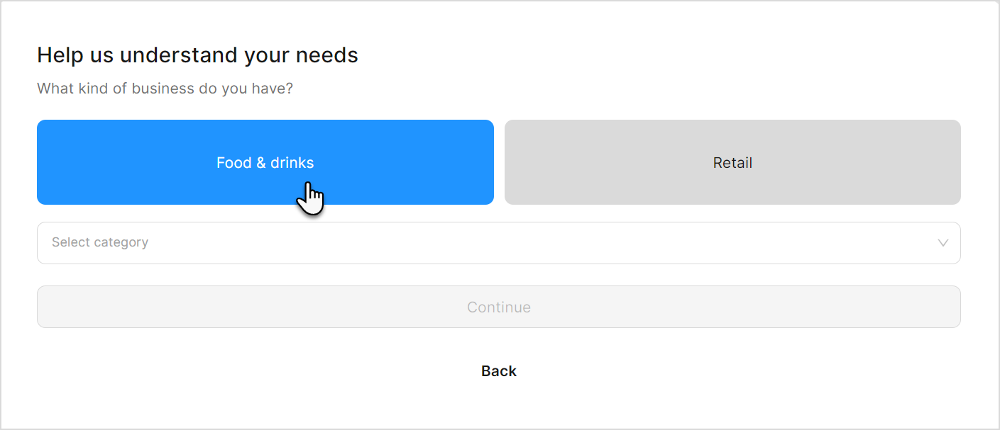
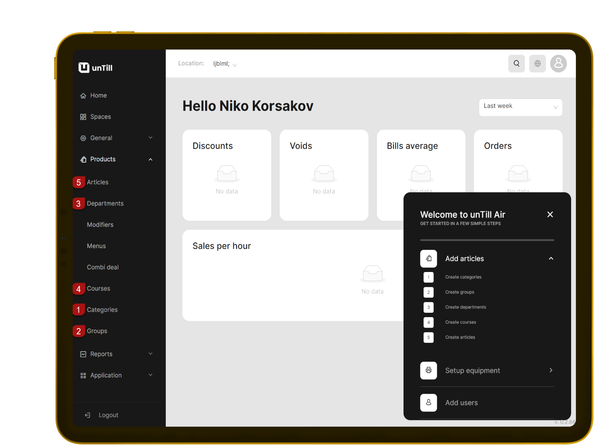
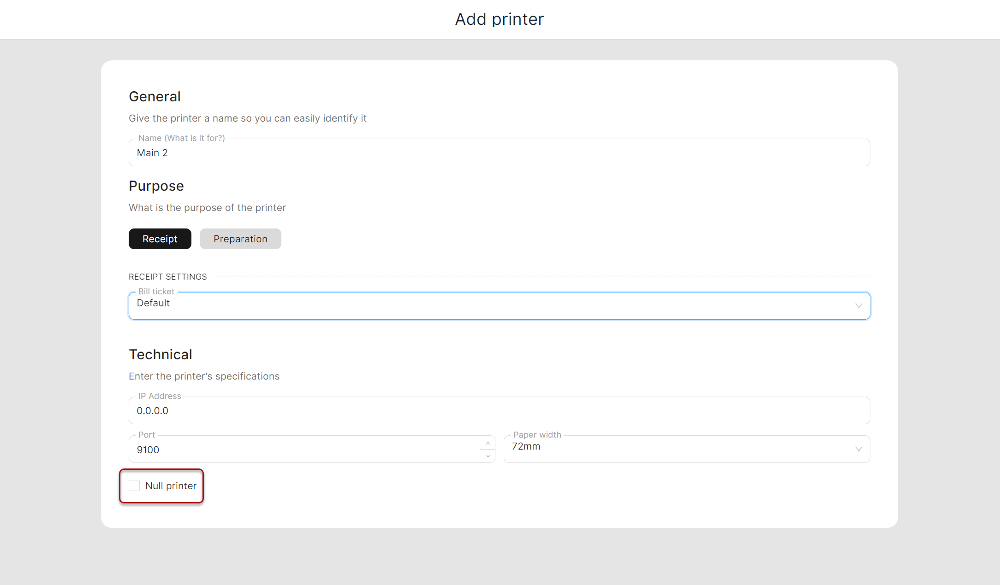
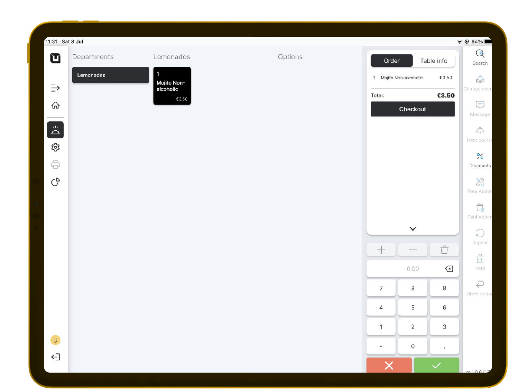

# Quick Start (Food & Drinks mode)

**Let's consider how to start working in** [**Table Plan**](../features/sales-modes/table-plan-mode/) **and** [**Direct Sales**](../features/sales-modes/direct-sales-mode.md) **modes**

**To start working in the 'Food & Drinks'**

1. Open [https://air.untill.com/](https://air.untill.com/) in your browser.
2. Sign Up.

* Choose **'Food & Drinks'**;

<figure><figcaption></figcaption></figure>

3. Select the appropriate subscription plan.
4. Choose whether you will work with or without tables.



If you have tables, select to work with them, create a space, and specify the number of tables.



If you don't work with tables, select that you're not and proceed.



5. Create an article Non-Alcoholic Mojito:

* Add a new **'Category'** (Drinks)
* Add a new **'Group'** (Non-Alcoholic)
* Add a new **'Department'** (Lemonades)
* Add a new **'Course'** (Main)
* Add a new **'Article'** (Non-Alcoholic Mojito)

<figure><figcaption></figcaption></figure>

6. Navigate to the **'General' > 'Equipment'.**
7. Add a printer.


If you don't have a printer yet, select 'Null printer' feather ture to simulate the working process without printing actual receipts.


<figure><figcaption></figcaption></figure>

8. Add a tablet.



Add a tablet in **'Table Plan'** mode



Add a tablet in **'Direct Sales'** mode



9. Install **'unTill Air'** on your tablet.
10. Run and scan QR Code on your tablet to connect.
11. Now you can make your first order on the tablet!

<figure><figcaption></figcaption></figure>

You can learn more about the [Back Office](../back-office-intro.md), where you can create articles, and the [POS](../pos-intro.md), where you can place orders. Additionally, we recommend exploring the essential feature of [unTill Payments](../untill-payments.md).
