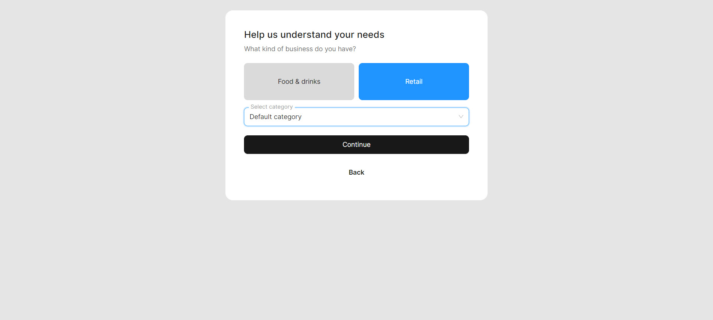
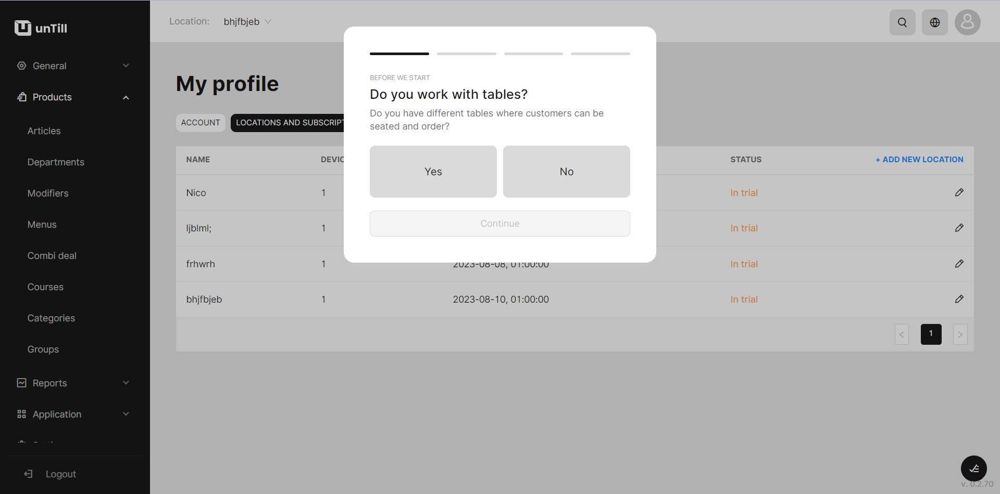
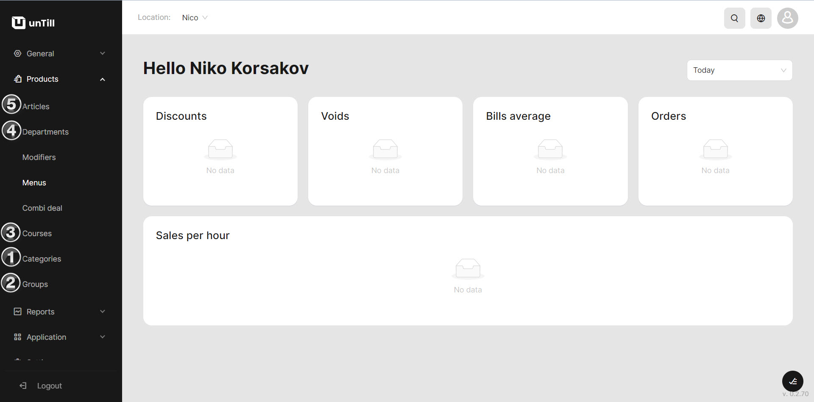
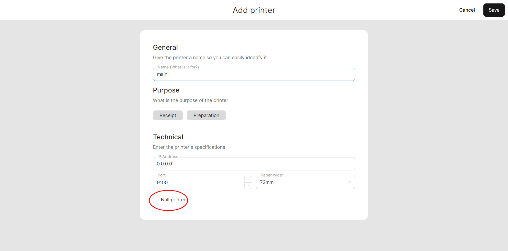

# Quick Start (Retail mode)

**Let's consider how to start working in Retail mode**

1. Open [https://air.untill.com/](https://air.untill.com/) in your browser.
2. Sign Up.

* Choose **'Retail'**

<figure><figcaption></figcaption></figure>

* Choose that you don't use tables and Happy hours.

<figure><figcaption></figcaption></figure>

3. Create an article Non-Alcoholic Mojito: &#x20;

* Add new **'Category'** (Drinks)
* Add new **'Group'** (Non-Alcoholic)
* Add new **'Department'** (Lemonades)
* Add new **'Course'** (Main)
* Add new **'Article'** (Non-Alcoholic Mojito)

<figure><figcaption></figcaption></figure>

4. Navigate to the 'General' > 'Equipment'
5. Add a printer


If you don't have a printer yet, select **'Null printer'** feature to simulate the working process without printing actual receipts.


<figure><figcaption></figcaption></figure>

6. Add a tablet in 'Direct sales' mode

<figure><figcaption></figcaption></figure>

7. Install **'unTill Runner'** on your tablet.
8. Run and scan QR Code on your tablet to connect.
9. Now you can make your first order on the tablet!&#x20;

<figure><figcaption></figcaption></figure>

_You can learn more about the_ [_Back Office_](../back-office-intro.md)_, where you can create articles, and the_ [_POS_](../pos-intro.md)_, where you can place orders. Additionally, we recommend exploring the essential feature of_ [_unTill Payments_](../untill-payments.md)_._
