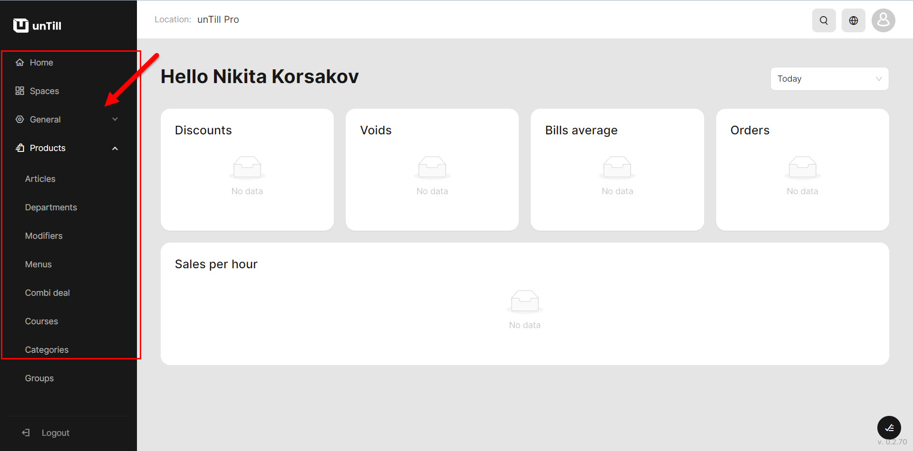

# Set up your account

About creating a space and other...

Being on home page you'll see on the left-side panel different sections which allow to set up an account of user. You may look through these sections and click on each of them.

* When you navigate to the `Home` page, you will find a display featuring key reports for running and managing your organization. These reports include discounts, voids, average bill, orders, and sales per hour. Furthermore, you can customize the date range in the upper right corner of the page to ensure you have a comprehensive understanding of your business operations.
* When you navigate to the `Spaces` page, you will find your existing spaces, which represent the areas where you accommodate your clients, such as a terrace, floor, or bar. Within each space, you can select the desired quantity of tables and specify other conditions, including the presence or absence of special pricing. By accessing the Spaces section, it implies that you have already created at least one space. From there, you can proceed to work with it, review and enhance its features, and expand it further using the same approach. You have full control over your spaces: you can delete existing spaces, create new ones, or modify conditions such as the number of tables. Additionally, you can customize visual elements to create a more realistic representation of your dining space.
* Further you may see multioptional section which is called `General`. When you click on it, some different options and path of settings become opened. It includes: Currency, Payment methods, VAT levels, Equipment, Article messages, Discounts, Periods, Reasons, Tickets.&#x20;

<figure><figcaption>
Here are the sections
</figcaption></figure>

For setting up you'll need to abide the right sequence of actions. It's a gradual procces of tuning the account. At first you need to set up one option, then another.

Learning the terms

But at first you can learn more about these sections of the interface. You may find the definitions for them in our Glossary. Or you can read separate manuals about them on other pages (simply click on term in the table and learn something new about it).

