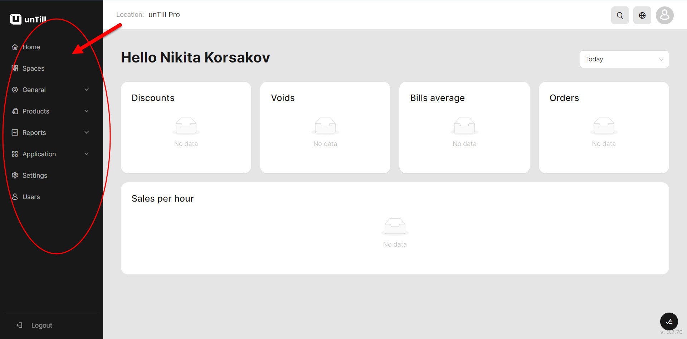

# Set up your account

About creating a space and other...

Being on home page you'll see on the left-side panel different sections which allow to set up an account of user. You may look through these sections and click on each of them.

#### Home page

When you navigate to the `Home` page, you will find a display featuring key reports for running and managing your organization. These reports include discounts, voids, average bill, orders, and sales per hour. Furthermore, you can customize the date range in the upper right corner of the page to ensure you have a comprehensive understanding of your business operations.

<figure><figcaption>
Home page and column of sections
</figcaption></figure>

#### Spaces

When you navigate to the `Spaces` page, you will find your existing spaces, which represent the areas where you accommodate your clients, such as a terrace, floor, or bar. Within each space, you can select the desired quantity of tables and specify other conditions, including the presence or absence of special pricing. By accessing the Spaces section, it implies that you have already created at least one space. From there, you can proceed to work with it, review and enhance its features, and expand it further using the same approach. You have full control over your spaces: you can delete existing spaces, create new ones, or modify conditions such as the number of tables. Additionally, you can customize visual elements to create a more realistic representation of your dining space.

More information about space <a href="broken-reference">here</a> 

In this range of articles, you can find detailed information about creating, modifying, tuning, and deleting spaces.

#### General

Further you may see versatile section called `General` that offers various settings and options. Clicking on it will open different paths and options, including Currency, Payment Methods, VAT Levels, Equipment, Article Messages, Discounts, Periods, Reasons, and Tickets. These settings are essential for ensuring successful operations with unTill Air. As you begin, we suggest starting with the 'Equipment' section, where you can easily connect your devices to the system, such as terminals, printers, or tablets. Connecting your devices should be one of your initial steps. To help you with this process, follow these quick steps or refer to the comprehensive manual for more detailed instructions: &#x20;

1. Click on the `Add new equipment` button;
2. Choose the type of device you would like to connect;
3. Give a name for your new connected device to distinguish it from the others;
4. Enter information about your device and, if applicable (only in the case of a printer), specify; the purpose for which you intend to use it;
5. Once you have finished entering the information about your device, click on the `Save` button.

_Your device is now ready to use!_

Other manuals about <code>General</code> you'll find <a href="broken-reference">here</a>

You can explore all the features that General incorporates by referring to these manuals. This will help you learn how to configure `Discounts`, manage `Article messages`, and more.

#### Products

For setting up in section `Products` you'll need to abide the right sequence of the actions. It's a gradual procces of tuning the account. At first you need to set up one option, then another.&#x20;

Learning the terms

But at first you can learn more about these sections of the interface. You may find the definitions for them in our Glossary. Or you can read separate manuals about them on other pages (simply click on term in the table and learn something new about it).

