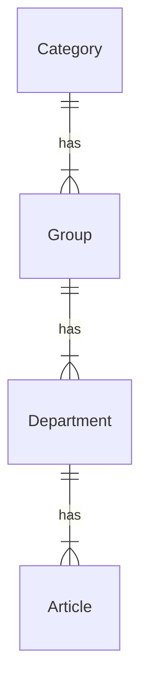
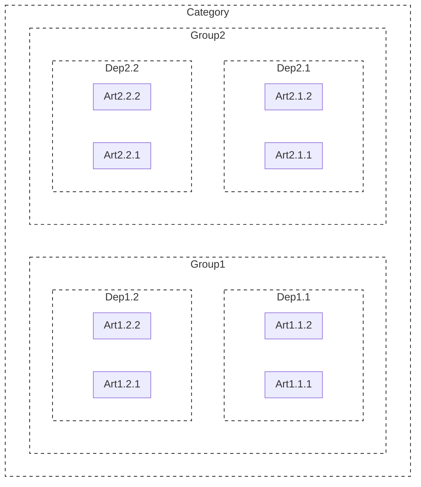

# Products

In unTill Air, the 'Products' section follows a hierarchical structure where different levels are interconnected. At the foundation of this hierarchy is the 'Article' level, which serves as the fundamental block. As we move up the hierarchy, each level takes on a level of subordination until we reach the top level, which is the 'Category.' The 'Category' level includes all the other levels, forming a comprehensive and organized system for managing your restaurant's products.

***

