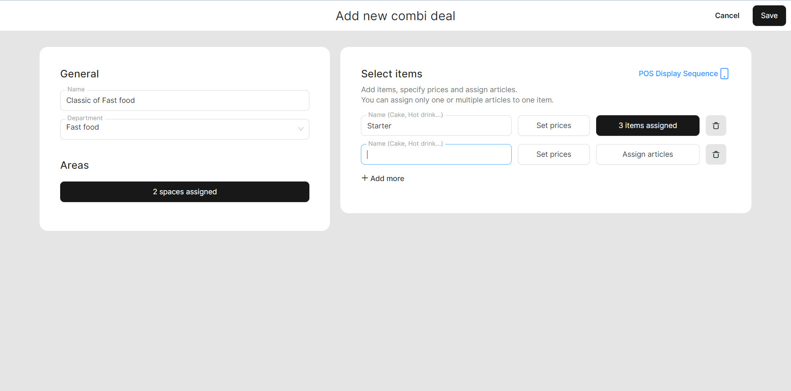

# Manage Combi deals

<table data-card-size="large" data-view="cards" data-full-width="true"><thead><tr><th></th><th></th><th></th></tr></thead><tbody><tr><td><strong>Who can use this feature?</strong></td><td>✔<mark style="color:green;">Owners</mark> in the Back Office</td><td></td></tr></tbody></table>

To create a **'Combi deal'**, please follow these steps:

1. Navigate to the **'Products' > 'Combi deal'**.
2. Click **'Add new combi deal'**.
3. Provide a name to your combi deal.
4. Assign your 'Combi deal' to the relevant department and spaces.
5. Select the items.

* Provide a name to the component of your combi deal;
* Set price for this;
* Add a new component to your **'Combi deal'** by following all the previous steps.

<figure><figcaption></figcaption></figure>

6. After creating all the desired components of the 'Combi deal', make sure to click the **'Save'** button.

**Here is an example of creating the components of the 'Combi deal:**

| Name      | Price  | Assigned articles                        |
| --------- | ------ | ---------------------------------------- |
| Starter   | 1.50 € | Fries; Boiled potato                     |
| Main dish | 3 €    | Burger; Fish roll                        |
| Drink     | 3 €    | Non-Alcoholic Mojito; Orange juice fresh |


Now that you have created a 'Combi deal', you can now use it in the POS. For detailed instructions on how to utilize the 'Combi deal' in the POS, please [refer to the dedicated manual](use-a-combi-deal-in-the-pos.md).

