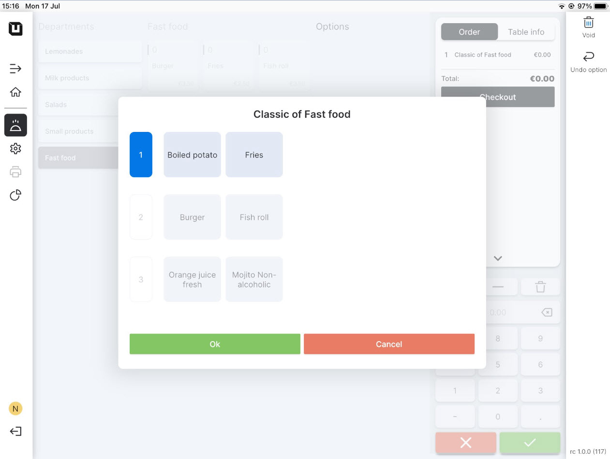
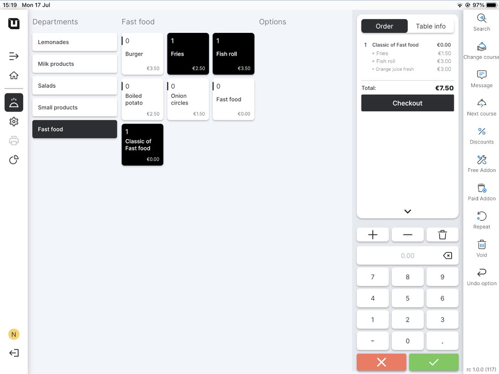

# Use Combi deals

***

<table data-card-size="large" data-view="cards" data-full-width="false"><thead><tr><th></th><th></th><th></th></tr></thead><tbody><tr><td><strong>Who can use this feature?</strong></td><td>✔<mark style="color:orange;">POS users</mark></td><td></td></tr></tbody></table>


You can implement a 'Combi deal' once you have already created and set it up in the Back Office. [Refer to this manual](create-a-combi-deal.md) to create and set up 'Combi deal'.


To start using the 'Combi deal' in the POS, please follow these steps:

1. Open the application 'unTill Air' on your tablet.
2. Click on the table in your space to place an order.
3. Among the articles in a department to which you have assigned the **'**Combi deal', you will see the name of your new 'Combi deal', click on it.
4. As a POS user, you have the option to select one item from each line within the 'Combi deal,' based on the customer's preferences.

<figure><figcaption></figcaption></figure>

4. When you are finishing fulfilling the order, you will see that these articles are placed in an order with the price you indicated in the **'Combi deal'**.

<figure><figcaption></figcaption></figure>

5. Now you can proceed to finish the order.
