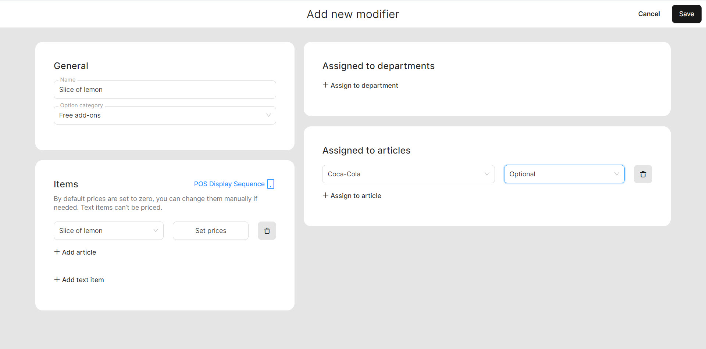

# Manage Modifiers

<table data-card-size="large" data-view="cards" data-full-width="false"><thead><tr><th></th><th></th><th></th></tr></thead><tbody><tr><td><strong>Who can use this feature?</strong></td><td>✔<mark style="color:green;">Location Owners</mark> in the Back Office</td><td></td></tr></tbody></table>

To **create a modifiers**, please follow these steps:

1. Navigate to the **'Products' > 'Modifiers'.**
2. Click **'Add new modifier'.**
3. Give a name to new modifier and select **'Option category'.**

| Option category | Meaning                                                                                                                                                    |
| --------------- | ---------------------------------------------------------------------------------------------------------------------------------------------------------- |
| Paid add-ons    | These modifiers are provided to customers with an associated price since paid add-ons are intended to require customers to pay for additional ingredients. |
| Free add-ons    | These modifiers are provided to customers for free as they do not require any additional fees from the client.                                             |

4. Select items which will be used as a **'Modifier'**.
5. Assign a **'Modifier'** to a specific article or several articles.
6. Choose between 'optional' and 'mandatory' display of the **'Modifier'** in the POS during taking the order.

<figure><figcaption></figcaption></figure>

4. Click **'Save'** button


You have successfully created a new modifierб you are able to use it within the POS system. Please, read the next manual to learn how to effectively use the modifier in your POS operations.

