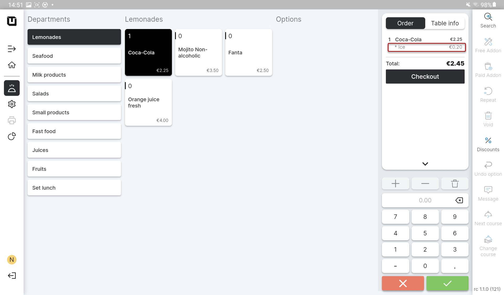

# Use Modifiers

To **start using 'Modifier' in the POS**, please follow these steps:

1. Open the application **'unTill Air'** on your tablet.
2. Create an order using the **'Article'** with a **'Modifier'**.
3. Pay the attention to the result with **'Modifiers'**:

**Optional 'Modifier'**

* You'll see initially the item which you've ordered without a 'Modifier';
* If a customer requests to add a 'Modifier', simply tap on the item in the order list to include the desired 'Modifier';

<figure><figcaption></figcaption></figure>


If you set a price for the modifier, it will be applied regardless of any other settings or options.&#x20;


<figure><figcaption></figcaption></figure>

**Mandatory 'Modifier'**

* You'll see the item straight away with a **'Modifier'**;
* This item will be sold already with a **'Modifier'**;

<figure><figcaption></figcaption></figure>
