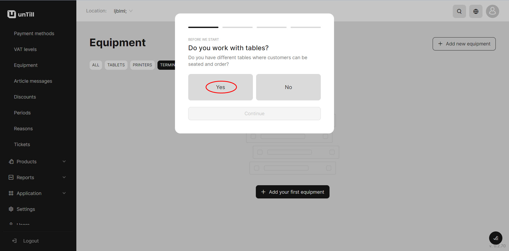
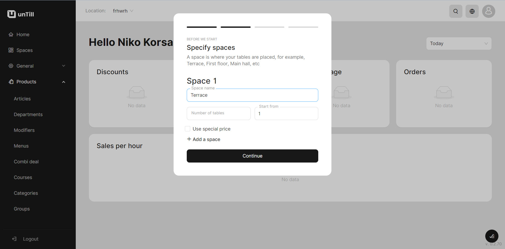
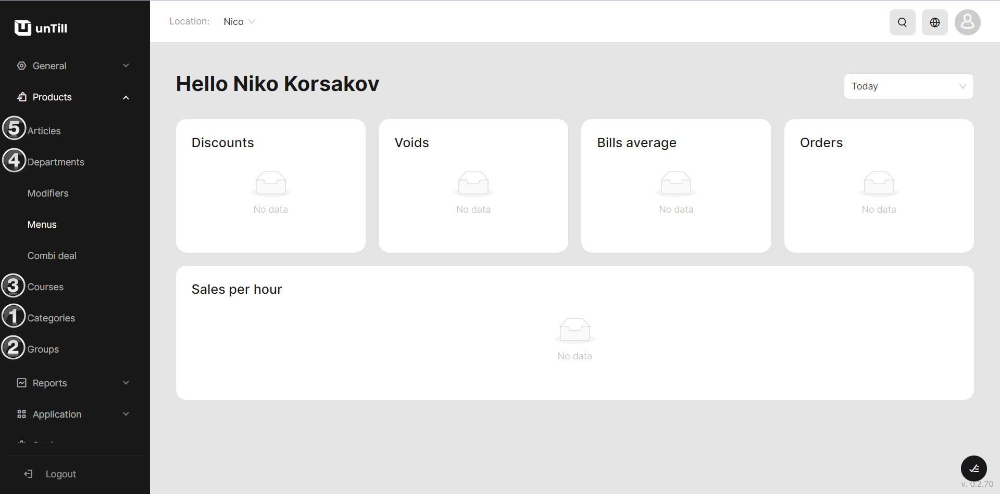

# Quick Start (Table Overview mode)

**Let's consider how to start working in**[ **Table Overview mode**](general/table-overview-mode.md)

1. Open [https://air.untill.com/](https://air.untill.com/) in your browser.
2. [Sign Up](getting-started/quick-start/sign-up-to-untill-air.md).

* Choose 'Food & Drinks';

<figure><figcaption></figcaption></figure>

* Choose that you use tables, create a table space 'Terrace' and specify the number of tables;

<figure><figcaption></figcaption></figure>

 

<figure><figcaption></figcaption></figure>

3. Create an article Non-Alcoholic Mojito: &#x20;

* Add new 'Category' (Drinks)
* Add new 'Group' (Non-Alcoholic)
* Add new 'Department' (Lemonades)
* Add new Course (Main range)
* Add new Article (Non-Alcoholic Mojito)

<figure><figcaption></figcaption></figure>

3. Navigate to the 'Equipment' section under the 'General' category.
4. Add a printer.


If you don't have a printer yet, select 'Null printer' feature to simulate the working process without printing actual receipts.


<figure><figcaption>
Null printer
</figcaption></figure>

6. Add a tablet in 'Table Overview' mode.

<figure><figcaption>
Table Overview mode
</figcaption></figure>

7. Install 'unTill Runner' on your tablet.
8. Run and scan QR Code on your tablet to connect.
9. Simulate first order on your tablet.&#x20;

<figure><figcaption></figcaption></figure>


If you're a retailer, refer to [this manual](retailer-mode.md) for setting up your account.


_Once you have initiated orders in Table Overview mode, you have the option to add discounts to your account. For detailed instructions on how to add discounts, please refer to the documentation provided_ [_here_](general/discounts.md)_._
