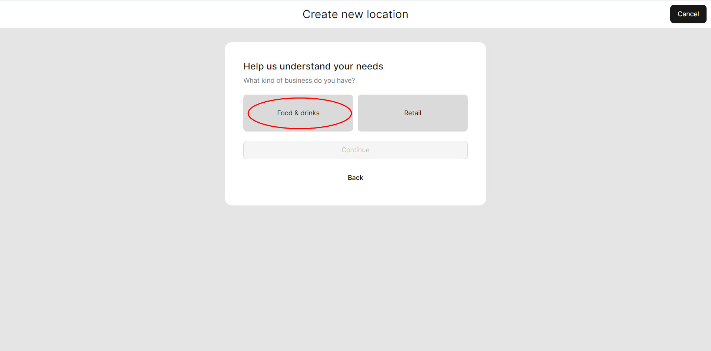

# Quick Start (Table Overview mode)

**Let's consider how to start work in**[ **Table Overview mode**](general/table-overview-mode.md)

1. Open [https://test.air.untill.com/#/](https://test.air.untill.com/#/) in your browser
2. Sign Up

* Choose 'Food & Drinks'

<figure><figcaption></figcaption></figure>

* Choose that you use tables and specify their number

3. Create an article Mojito Non-Alcoholic&#x20;

* Add new 'Category' (Drinks)
* Add new 'Group' (Non-Alcoholic)
* Add new 'Department' (Lemonades)
* Add new Course (Main range)
* Add new Article (Mojito Non-Alcoholic)

<figure><figcaption></figcaption></figure>

3. Navigate to the 'Equipment' section under the 'General' category
4. Firstable, add a printer


If you want to test and simulate the working process without printing actual receipts, you can click on the 'Null printer' button. This option ensures that real checks will not be printed and is only meant for checking purposes


<figure><figcaption>
Null printer
</figcaption></figure>

6. Secondly, you can add a tablet

* Choose 'Table Overview' mode

<figure><figcaption>
Table Overview mode
</figcaption></figure>

* Install 'unTill Runner' on your tablet
* Scan QR Code on your tablet to connect

7. Simulate first order on your tablet&#x20;
