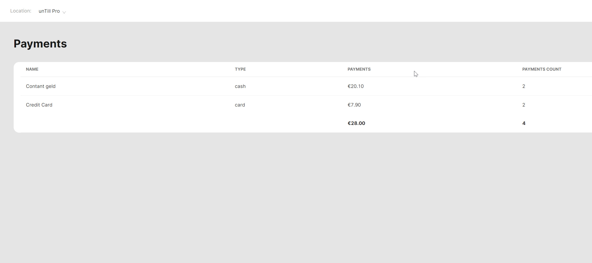

# Payments Reports

<table data-card-size="large" data-view="cards"><thead><tr><th></th><th></th><th></th></tr></thead><tbody><tr><td><strong>Who can use this feature?</strong></td><td>✔<mark style="color:green;">Location Owners</mark> in the Back Office</td><td></td></tr></tbody></table>

By utilizing the information provided in these reports, you will have the ability to analyze and understand the preferred methods of payment among your customers. This valuable insight can help you make informed decisions. Additionally, you can identify trends, patterns and potential areas for improvement in your payment processes to improve your services.

To get a **Payments Report**, please follow to these steps:

1. Navigate to the **'Reports' > 'Payments'**.
2. Specify the period of report and explore the data.

<figure><figcaption></figcaption></figure>


Now you are totally informed about the ratio between cash and cashless payment methods in your restaurant.

