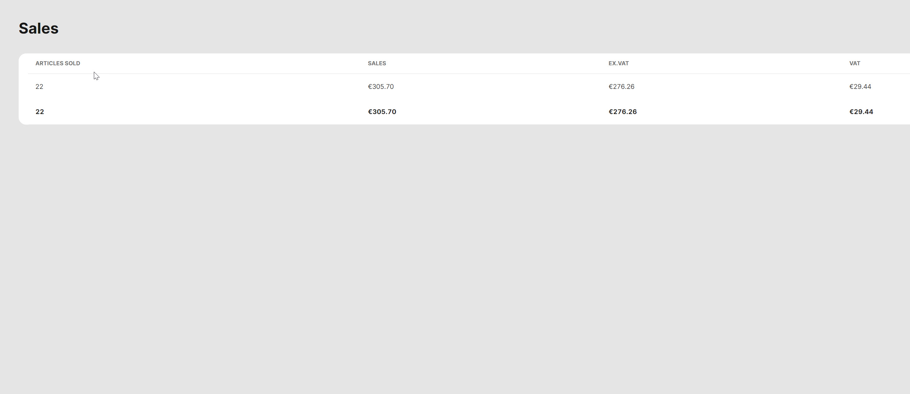

# Sales Reports

<table data-card-size="large" data-view="cards"><thead><tr><th></th><th></th><th></th></tr></thead><tbody><tr><td><strong>Who can use this feature?</strong></td><td>✔<mark style="color:green;">Location Owners</mark> in the Back Office</td><td></td></tr></tbody></table>

Sales Reports provide a comprehensive overview of all sales operations, allowing you to have a complete picture of your business transactions. These reports not only showcase the structure of sales but also provide clear insights into payments for individual products and VATs. By leveraging Sales Reports, you can gain valuable insights into your organization's business processes and make informed assessments of your sales performance.

#### We offer three types of Sales Reports: 'Sales', 'Sales per hour' and Sold Articles.&#x20;

'Sales Report' provides a comprehensive overview, allowing you to understand the overall financial health of your restaurant. It gives you a broader picture of sales performance.

On the other hand, the 'Sales per hour Report' provides more detailed information on sales within specific time periods. This report offers a deeper view on your sales, allowing you to analyze this with maximum detail.

To get a **'Sales report'**, please follow these steps:

1. Navigate to the **'Reports' > 'Sales'**.
2. Specify the period of the report and explore the data.

<figure><figcaption>
Example of 'Sales Reports'
</figcaption></figure>

To get a **'Sales per hour report'**, please follow these steps:

1. Navigate to the **'Reports' > 'Sales per hour'**.
2. Specify the period of the report and explore the data.

<figure><figcaption></figcaption></figure>

To get a 'Sold Articles report', please follow these steps:

1. Navigate to the 'Reports' > 'Sold Articles'.
2. Specify the period of the report and explore the data.
