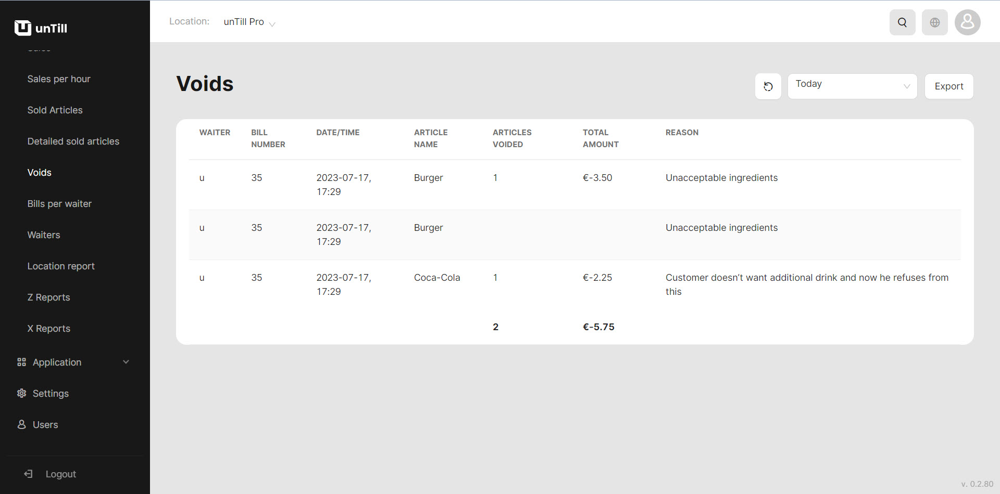

# Voids Reports

<table data-card-size="large" data-view="cards" data-full-width="true"><thead><tr><th></th><th></th><th></th></tr></thead><tbody><tr><td><strong>Who can use this feature?</strong></td><td>✔<mark style="color:green;">Owners</mark> in the Back Office</td><td></td></tr></tbody></table>

Voids reports enable you to monitor and track void transactions, allowing you to stay informed about the preferences of your clients. Additionally, voids reports provide visibility into the actions of POS users (waiters) who have performed voids, giving you insight into their activities.

To get the report, please follow these instructions:

1. Navigate to the **'Reports' > 'Voids'**.
2. Select specific period to get the information about voids.

<figure><figcaption></figcaption></figure>


About the 'Reasons' that are included in this report, you can find more information by [referring to the provided manual](../general/reason/create-a-reason-bo.md).

